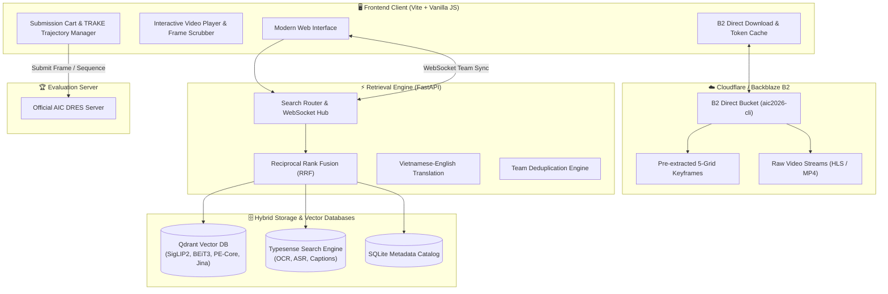

<div align="center">

# ⚡ T-S-T AIC SYSTEM ⚡
### *High-Performance Multi-Modal Interactive Video Retrieval Engine*

[](https://python.org)
[](https://fastapi.tiangolo.com)
[](https://qdrant.tech)
[](https://typesense.org)
[](https://vitejs.dev)
[](https://backblaze.com)
[](https://docker.com)

<p align="center">
  <b>Built for the Ho Chi Minh City AI Challenge (AIC 2026)</b><br>
  A production-grade, distributed video search and real-time retrieval platform engineered for ultra-fast candidate identification, temporal reasoning, and sub-second evaluation submission.
</p>

---

</div>

## 🌟 Key Highlights & Core Innovations

### ⚡ 1. Direct Edge Frame Streaming (Backblaze B2 + CDN)
- **Zero Backend Bottleneck**: 100% client-side parallel asset retrieval directly from B2 cloud storage via cached authorization tokens.
- **Smart 5-Grid Snapping**: Automatically snaps target timestamps to exact physical candidate keyframes (`Math.round(f / 5) * 5`) with candidate `r.frame_path` direct routing.
- **Dynamic Bandwidth Management**: Video boundary prefetching is intelligently toggled off during interactive bursts to prioritize instant image rendering.

### 🧠 2. Deep Multi-Modal Hybrid Search Pipeline
- **Visual Encoders**: Ensembled embeddings leveraging **SigLIP-2**, **BEiT-3**, **PE-Core**, and **Jina-CLIP v5**.
- **Lexical & Semantic Fusion**: Real-time cross-modal reranking combining visual dense vectors (Qdrant), ASR transcripts, OCR text, and dense captions via **Reciprocal Rank Fusion (RRF)**.
- **Auto Cross-Lingual Translation**: Automatic Vietnamese-to-English query translation (`translate=true`) with manual override (`Alt+E`).

### 🎯 3. Multi-Task Competition Ready
- **KIS (Known-Item Search)**: Multi-query temporal chaining with millisecond-exact frame pinpointing.
- **VQA (Video Question Answering)**: Visual-linguistic reasoning with integrated answer generation and context scoring.
- **TRAKE (Target Tracking & Action Sequence)**: Multi-frame sequence builder, interactive drag-and-drop reordering with insertion drop markers, snapshot undo (`↩ Undo`), and instant manual fallback modal (`Alt+M`).

### 👥 4. Real-time Team Collaboration & Deduplication
- **WebSocket Synchronization**: Real-time state broadcasting across operators (`/ws/team`, `/ws/dres`, `/ws/queue`, `/ws/trake`).
- **Collision & Duplicate Prevention**: In-memory and distributed lock tracking of submitted queries, warning team members before redundant submissions to DRES.

---

## 🏛️ System Architecture



---

## 📂 Repository Structure

```plaintext
.
├── backend/                        # FastAPI Search Engine
│   ├── backend/
│   │   ├── app.py                  # Main application & routing entrypoint
│   │   ├── config.py               # Dynamic settings & environment loader
│   │   └── ...
│   ├── src/
│   │   ├── pipeline/               # Multi-modal fusion & search engine
│   │   ├── models/                 # Model adapters & inference wrappers
│   │   └── utils/                  # Text processing, B2 signers, RRF utils
│   ├── Dockerfile                  # Containerization specification
│   ├── requirements.txt            # Python dependencies
│   └── run_final_api.sh            # Production startup script
│
├── frontend/                       # Interactive Web Retrieval Interface
│   ├── index.html                  # Main SPA markup & responsive layout
│   ├── style.css                   # Custom modern dark-mode stylesheet
│   ├── app.js                      # Core frontend application & state machine
│   ├── server.py                   # Lightweight proxy / static server
│   ├── vite.config.js              # Vite bundler & dev server config
│   ├── src/
│   │   ├── scripts/                # Modular client utilities & WebSocket handlers
│   │   └── styles/                 # Granular component styles
│   └── public/                     # Static icons, vector assets & SVG sprites
│
└── README.md                       # Documentation & Operations Manual
```

---

## ⌨️ Power-User Shortcuts Cheatsheet

| Shortcut | Scope | Action |
| :--- | :--- | :--- |
| **`Enter`** | Query Input | Execute search query (Shift+Enter for newline) |
| **`Ctrl + Enter`** | Query Input | Best-frame refinement on selected video candidate |
| **`/`** | Global | Instantly focus the main query input |
| **`1` · `2` · `3`** | Global | Switch task mode: **KIS** · **VQA** · **TRAKE** |
| **`Alt + E`** | Global | Toggle automatic Vietnamese → English translation |
| **`Alt + W`** | Global | Toggle Grid view ↔ Grouped-by-video view |
| **`Alt + A`** | Global | Open / Close submission cart drawer |
| **`Alt + M`** | Global | Open General Manual Submission Modal |
| **`Ctrl + S`** | Global | Quick-submit top candidate to DRES |
| **`Space`** | Video Player | Play / Pause video playback |
| **`←` / `→`** | Video Player | Jump backward / forward by 5 seconds (1 frame with `◀ 1f` / `1f ▶`) |
| **`Hold Shift`** | Video / Hover | Turbo speed **x1.5** (reverts on release) |
| **`Hold Shift + Z`** | Video / Hover | Maximum speed boost **x2.0** |
| **`G`** | Video Player | Quick Jump: Type target frame index + Enter |
| **`C`** | Video Player | Add current frame to Submission Cart |
| **`S`** | Video Player | Directly submit current frame to DRES |
| **`1` – `4`** | Video Player | Set playback rate: 0.5x · 1.0x · 1.5x · 2.0x |

---

## 🚀 Quick Start Guide

### 1. Launch Backend Service

```bash
cd backend

# Setup environment
python3 -m venv venv
source venv/bin/activate
pip install -r requirements.txt

# Run the search API server (Default: Port 8602)
bash run_final_api.sh
```

### 2. Launch Frontend Client

```bash
cd frontend

# Install Node dependencies
npm install

# Start Vite development server
npm run dev
```

Open your browser at `http://localhost:8084` to access the interactive search workspace.

---

## 🛡️ License & Acknowledgements

- Developed by the **T-S-T Team** for **Ho Chi Minh City AI Challenge (AIC 2026)**.
- Powered by open-source vision-language models and vector databases: [Qdrant](https://qdrant.tech), [Typesense](https://typesense.org), [HuggingFace](https://huggingface.co).
